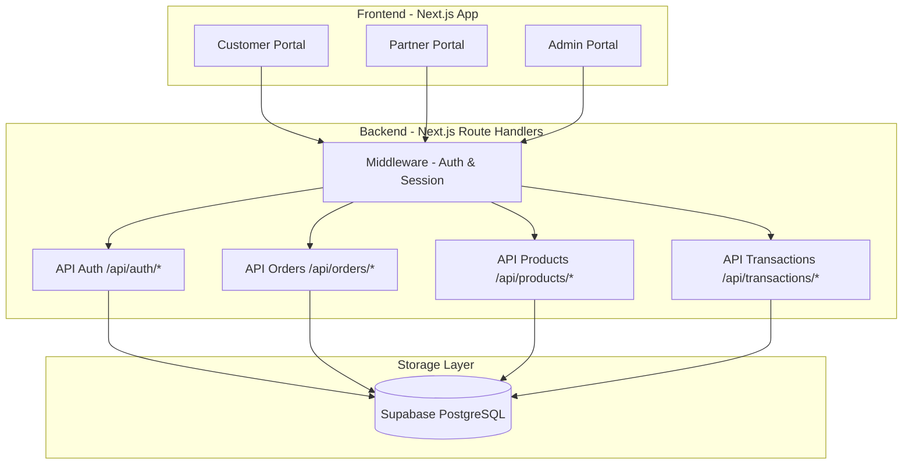
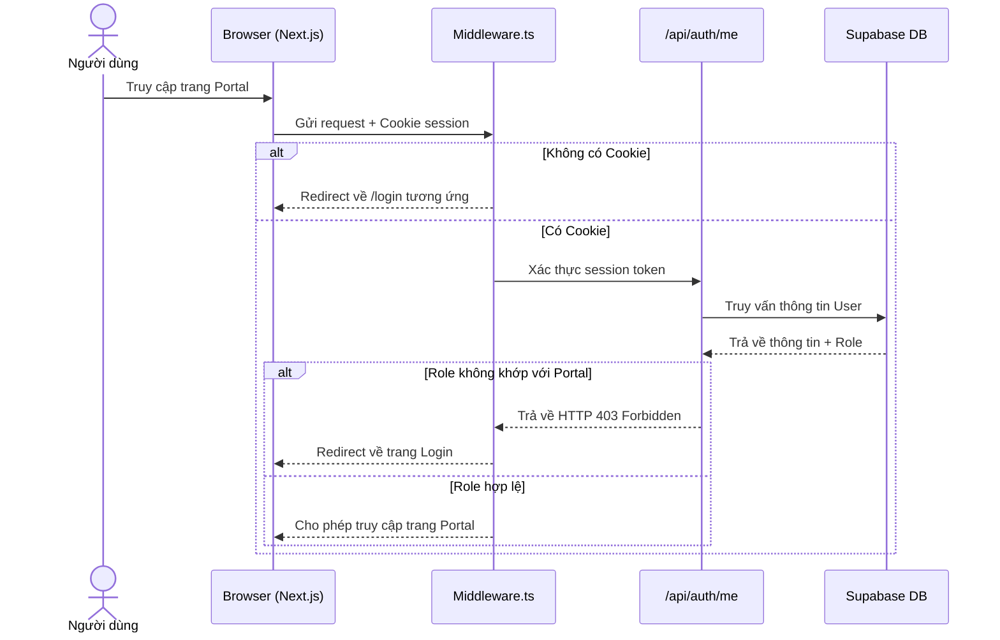
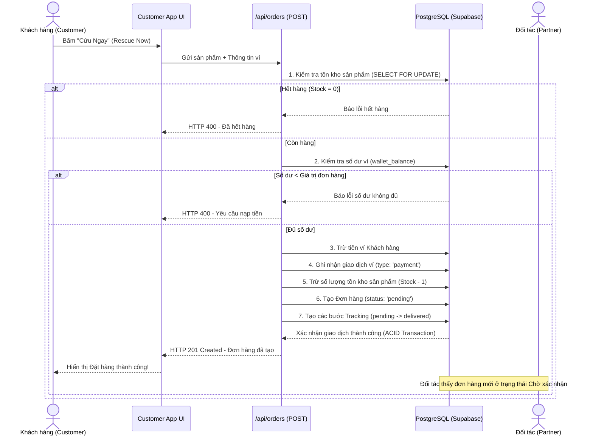
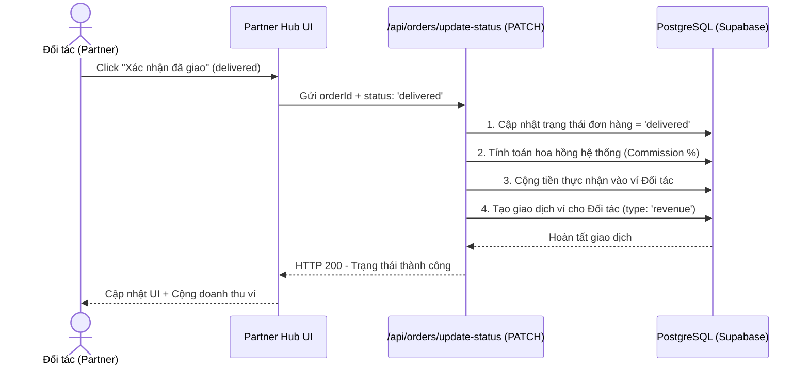

# 📚 F.R.E.S.H System Documentation
## Kiến Trúc Hệ Thống, Logic & Luồng Hoạt Động (Flow)

Tài liệu này mô tả chi tiết chức năng, logic nghiệp vụ, và các luồng hoạt động của 3 phân hệ chính trong nền tảng F.R.E.S.H (Food Rescue – ESG – Smart Hyperlocal): **Customer Portal**, **Partner Portal**, và **Admin Portal**.

---

## 🗺️ 1. Tổng Quan Kiến Trúc Hệ Thống (System Architecture)

Hệ thống F.R.E.S.H được phát triển dựa trên kiến trúc Next.js App Router (Fullstack) kết hợp dịch vụ cơ sở dữ liệu Supabase (PostgreSQL).

---

## 🔄 2. Các Luồng Hoạt Động Chính (Core System Flows)

### 2.1 Luồng Xác Thực & Phân Quyền (Auth & Session Flow)
Next.js Middleware chặn các request để xác thực session token (`fresh_session`). Mỗi portal yêu cầu các role tương ứng:
*   `/customer` yêu cầu role `customer`.
*   `/partner` yêu cầu role `partner`.
*   `/admin` yêu cầu role `admin`.

---

### 2.2 Luồng Đặt Hàng & Ví Điện Tử (Order & Wallet Flow)
Đây là luồng nghiệp vụ quan trọng nhất của hệ thống, xử lý đồng bộ giao dịch từ lúc Khách hàng đặt hàng cho đến khi Đối tác nhận tiền.

---

### 2.3 Luồng Cập Nhật Đơn Hàng & Doanh Thu Đối Tác (Order Fulfillment & Revenue Flow)
Khi đối tác giao hàng thành công, doanh thu sẽ được tự động cộng vào ví của Đối tác.

---

## 📱 3. Phân Hệ Khách Hàng (Customer Portal - `/customer`)

Phân hệ dành cho người tiêu dùng cuối, giúp tìm kiếm và giải cứu thực phẩm dư thừa sắp hết hạn sử dụng.

### 3.1 Các Tính Năng Chính
*   **Bản đồ Radar Ưu đãi**: Quét và định vị vị trí các cửa hàng đối tác (WinMart, Circle K,...) có thực phẩm giải cứu trong bán kính gần.
*   **Ví FRESH VIP**: Quản lý số dư, nạp tiền nhanh qua giả lập Momo/VNPAY để thực hiện thanh toán "Cứu Ngay" tức thì.
*   **Green Credit & ESG Impact**: Theo dõi chỉ số lượng thực phẩm đã cứu (kg) và lượng khí thải CO₂ đã giảm thiểu tương ứng (1kg thực phẩm giải cứu ~ 2.5kg CO₂).
*   **Lọc & Tìm Kiếm Thông Minh**: Lọc thực phẩm theo danh mục (Bakery, Dairy, Fruits, Meals,...) và thời gian hết hạn (Flash Deals).
*   **Hộp Quà & Phần Thưởng**: Đổi điểm tích lũy (Green Credits) lấy voucher giảm giá.

### 3.2 Logic & API Tương Tác
*   `GET /api/products`: Lấy danh sách sản phẩm có trạng thái `live` và còn hạn sử dụng.
*   `POST /api/orders`: Thực hiện tạo đơn hàng và trừ tiền ví tự động.
*   `POST /api/transactions`: Nạp tiền giả lập vào ví (`type: 'topup'`).

---

## 🏪 4. Phân Hệ Đối Tác (Partner Portal - `/partner`)

Giao diện chuyên biệt dành cho các cửa hàng, siêu thị để quản lý hàng tồn kho dư thừa và tối ưu hóa doanh thu.

### 4.1 Các Tính Năng Chính
*   **Quét Barcode AI (AI Scanner)**: Nhận diện mã vạch sản phẩm, tự động phân loại danh mục, ngày hết hạn và đề xuất mức giá giảm tối ưu bằng AI.
*   **AI Dynamic Pricing**: Logic giảm giá linh hoạt dựa trên thời gian hết hạn của sản phẩm (ví dụ: còn 12 giờ giảm 30%, còn 4 giờ giảm 60% để giải phóng kho).
*   **Quản Lý Kho Hàng**: Theo dõi số lượng tồn kho thực phẩm, trạng thái hiển thị (Live, Out of stock).
*   **Quản Lý Đơn Hàng Realtime**: Tiếp nhận đơn hàng từ Khách hàng, cập nhật các bước chuẩn bị hàng (`preparing` $\rightarrow$ `ready` $\rightarrow$ `delivered`).
*   **Báo Cáo Tài Chính (Finance)**: Biểu đồ doanh thu hàng ngày, theo dõi lịch sử giao dịch và rút tiền doanh thu về tài khoản ngân hàng liên kết.

### 4.2 Logic & API Tương Tác
*   `GET /api/orders/by-store?storeId=...`: Lấy danh sách đơn hàng khách đặt tại cửa hàng này.
*   `PATCH /api/orders/update-status`: Cập nhật trạng thái chuẩn bị và bàn giao đơn hàng.
*   `POST /api/products`: Đăng tải sản phẩm giải cứu mới lên hệ thống.

---

## 🛡️ 5. Phân Hệ Quản Trị (Admin Portal - `/admin`)

Trung tâm điều hành trung ương (Console) giúp doanh nghiệp giám sát toàn hệ thống, theo dõi dữ liệu phát triển bền vững (ESG) và bảo mật.

### 5.1 Các Tính Năng Chính
*   **ESG Metrics & CO₂ Dashboard**: Tổng hợp tổng lượng thực phẩm đã được giải cứu và lượng CO₂ cắt giảm trên toàn bộ mạng lưới hyperlocal.
*   **Quản Lý Thành Viên & Phân Quyền**: Kích hoạt, tạm ngưng hoặc cấm (Ban/Unban) tài khoản của Khách hàng hoặc Cửa hàng đối tác.
*   **Cyber Terminal & Log Auditor**: Giám sát log hệ thống realtime (giả lập bảo mật tường lửa, rate limit, kiểm tra kết nối database).
*   **Liên Kết Tài Khoản Ngân Hàng**: Quản lý tài khoản ngân hàng của Khách hàng phục vụ nạp/rút tiền tự động.
*   **Heatmap & Phân Tích Khu Vực**: Bản đồ mật độ giải cứu thực phẩm giữa các quận/huyện để định hướng mở rộng đối tác.
*   **AI Fraud Monitoring**: Phát hiện các giao dịch hoặc tài khoản có hành vi bất thường, spam đơn hàng.

### 5.2 Logic & API Tương Tác
*   `GET /api/users`: Lấy danh sách toàn bộ người dùng trong hệ thống.
*   `PATCH /api/users`: Thay đổi trạng thái tài khoản (`active`, `suspended`, `banned`).
*   `GET /api/bank-accounts`: Truy vấn tài khoản ngân hàng liên kết của từng User.

---

## 🔒 6. Cơ Chế Bảo Mật & Tối Ưu Hiệu Năng

1.  **Giao Dịch ACID (Database Transaction)**: Mọi thao tác đặt hàng, trừ tiền ví khách hàng, trừ tồn kho sản phẩm đều được bọc trong một Database Transaction duy nhất. Nếu một bước thất bại, toàn bộ quá trình sẽ được rollback để tránh mất mát tiền bạc hoặc lệch tồn kho (Race Condition).
2.  **Rate Limiter**: API Gateways ngăn chặn các hành vi brute-force và spam request đặt hàng liên tục.
3.  **Tắt Kiểm Tra Tĩnh Khi Deploy**: File `next.config.mjs` được thiết lập bỏ qua lỗi kiểm tra linting và TypeScript trong quá trình compile để đảm bảo thời gian triển khai Vercel tối ưu nhất (chỉ mất ~14 giây để compile thành công).
